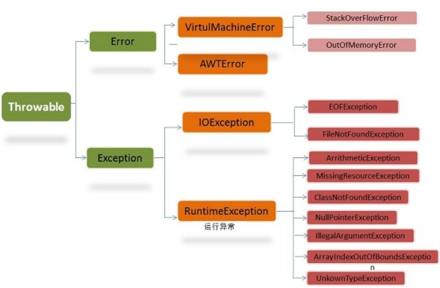

### JAVA面试指南---Part 01

---

<b>目录</b>

[TOC]

#### JDK和JRE有什么区别

 JDK：

​		Java Development Kit的简称，java开发工具包，提供了java 的开发环境和运行环境

 JRE:

​		Java Runtime Environment的简称，java运行环境，为java的运行提供所需要的环境

#### Override和Overload的作用/区别

 Override：

 		覆盖/重写，指的是在继承关系中子类中方法覆盖父类中的方法(除了访问修饰符相同/更宽，其它均相同)

 Overload：

 		重载，编译时多态,指的是在同一个类(或者具有继承关系的子类)中除了参数表不同的两个方法

#### this和super的作用/区别

 this：

​		1) 用于区分局部变量和实例变量

​		2) 用于调用构造方法

 super：

​		1) 用于区别被子类遮盖的属性/方法

​		2) 用于调用构造方法

#### 普通类和抽象类有什么区别

* 普通类不能包含抽象方法，抽象类可以(不是必须)包含抽象方法
* 抽象类不能直接实例化，普通类可以直接实例化

#### 接口和抽象类有什么区别

接口：

​		1) 接口中没有构造方法

​		2) 接口中方法全都是公开抽象方法

​		3) 接口中属性全是公开静态常量

​		4) 接口使用implements来实现接口

抽象类：

​		1) 抽象类中有构造方法

​		2) 抽象类中可以没有抽象方法

​		3) 抽象类不能使用final修饰

​		4) 抽象类使用extends来继承

#### ==和equals的区别

==：

​		它的作用是判断两个对象的地址是不是相等。即，判断两个对象是不是同一个对象。(基本数据类型==比较的是值，引用数据类型==比较的是内存地址)

equals：

​		equals是object中的方法,本质就是==

```java
/*object中的equals方法*/   
public boolean equals(Object obj) {
     return (this == obj);
}
```

​		String类重写了equals方法,使得字符串的equals比较变为了值比较

```java
  /*String类重写的equalls方法*/
	public boolean equals(Object anObject) {
        if (this == anObject) {
            return true;
        }
        if (anObject instanceof String) {
            String anotherString = (String)anObject;
            int n = value.length;
            if (n == anotherString.value.length) {
                char v1[] = value;
                char v2[] = anotherString.value;
                int i = 0;
                while (n-- != 0) {
                    if (v1[i] != v2[i])
                        return false;
                    i++;
                }
                return true;
            }
        }
        return false;
    }

```

#### hashcode()和equals()

**hashCode（）介绍**

​		hashCode() 的作用是获取哈希码，也称为散列码；它实际上是返回一个int整数。这个哈希码的作用是确定该对象在哈希表中的索引位置。hashCode() 定义在JDK的Object.java中，这就意味着Java中的任何类都包含有hashCode() 函数。

​		散列表存储的是键值对(key-value)，它的特点是：能根据“键”快速的检索出对应的“值”。这其中就利用到了散列码！（可以快速找到所需要的对象）

```java
/**
 * Java中的hashCode源码是空实现，使用native关键字说明这个方法是原生函数，
 * 也就是这个方法是用C/C++语言实现的，并且被编译成了DLL，由java去调用
 */    
public native int hashCode();
```


**为什么要有 hashCode**

​		我们以“HashSet 如何检查重复”为例子来说明为什么要有 hashCode。当你把对象加入 HashSet 时，HashSet 会先计算对象的 hashcode 值来判断对象加入的位置，同时也会与其他已经加入的对象的 hashcode 值作比较，如果没有相符的hashcode，HashSet会假设对象没有重复出现。但是如果发现有相同 hashcode 值的对象，这时会调用 equals（）方法来检查 hashcode 相等的对象是否真的相同。如果两者相同，HashSet 就不会让其加入操作成功。如果不同的话，就会重新散列到其他位置。（摘自我的Java启蒙书《Head first java》第二版）。这样我们就大大减少了 equals 的次数，相应就大大提高了执行速度。

**hashCode（）与equals（）的相关规定**

1. 如果两个对象相等，则hashcode一定也是相同的
2. 两个对象相等,对两个对象分别调用equals方法都返回true
3. 两个对象有相同的hashcode值，它们也不一定是相等的
4. **因此，equals 方法被覆盖过，则 hashCode 方法也必须被覆盖**
5. hashCode() 的默认行为是对堆上的对象产生独特值。如果没有重写 hashCode()，则该 class 的两个对象无论如何都不会相等（即使这两个对象指向相同的数据）

#### 重写equals

以下是jdk中推荐的重写equals应遵循的规则

> 规则
>
> The equals method implements an equivalence relation on non-null object references: 
>
> ​		It is reflexive: for any non-null reference value x, x.equals(x) should return true. 
> ​		It is symmetric: for any non-null reference values x and y, x.equals(y) should return true if and only if y.equals(x) returns true. 
> ​		It is transitive: for any non-null reference values x, y, and z, if x.equals(y) returns true and y.equals(z) returns true, then x.equals(z) should return true. 
> ​		It is consistent: for any non-null reference values x and y, multiple invocations of x.equals(y) consistently return true or consistently return false, provided no information used in equals comparisons on the objects is modified. 
> ​		For any non-null reference value x, x.equals(null) should return false. 
> The equals method for class Object implements the most discriminating possible equivalence relation on objects; that is, for any non-null reference values x and y, this method returns true if and only if x and y refer to the same object (x == y has the value true). 
>
> ​		Note that it is generally necessary to override the hashCode method whenever this method is overridden, so as to maintain the general contract for the hashCode method, which states that equal objects must have equal hash codes.
>
> 大致就是以下的判定标准
>
> 1. 自反性
> 2. 对称性
> 3. 传递性
> 4. 一致性
> 5. 对于非空引用x,x.equals(null)应为

```java
    @Override
    public boolean equals(Object o){
        /** 1.判断自反性:x.equals(x)=true*/
        if(this==o){
            return true;
        }
        /** 2.判断是否为null*/
        if(o==null){
            return false;
        }
        /** 3.判断是否是同一类对象*/
        if(o.getClass()!=this.getClass()){
            return false;
        }
        /** 4.强制类型转换*/
        Student student = (Student) o;
        if(this.age.equals(student.age)&&this.name.equals(student.name)){
            return true;
        }else {
            return false;
        }

    }

```


#### 自动装箱和自动拆箱

自动装箱：

​		将基本类型用他们对应的引用类型包装起来

自动拆箱：

​		将包装类型转化为基本数据类型

​		1）String--->int				Integet.parseInt(string)

​		2)  String--->Integer		Integer.valueOf(String)

#### String 、StringBuffer 、 StringBuilder 的区别

**可变性** 　

简单的来说：String 类中使用 final 关键字字符数组保存字符串，`private　final　char　value[]`，所以 String 对象是不可变的。而StringBuilder 与 StringBuffer 都继承自 AbstractStringBuilder 类，在 AbstractStringBuilder 中也是使用字符数组保存字符串`char[]value` 但是没有用 final 关键字修饰，所以这两种对象都是可变的。

StringBuilder 与 StringBuffer 的构造方法都是调用父类构造方法也就是 AbstractStringBuilder 实现的，大家可以自行查阅源码。

AbstractStringBuilder.java

```java
abstract class AbstractStringBuilder implements Appendable, CharSequence {
    char[] value;
    int count;
    AbstractStringBuilder() {
    }
    AbstractStringBuilder(int capacity) {
        value = new char[capacity];
    }
```

**线程安全性**

String 中的对象是不可变的，也就可以理解为常量，线程安全。AbstractStringBuilder 是 StringBuilder 与 StringBuffer 的公共父类，定义了一些字符串的基本操作，如 expandCapacity、append、insert、indexOf 等公共方法。StringBuffer 对方法加了同步锁或者对调用的方法加了同步锁，所以是线程安全的。StringBuilder 并没有对方法进行加同步锁，所以是非线程安全的。 　　

**性能**

每次对 String 类型进行改变的时候，都会生成一个新的 String 对象，然后将指针指向新的 String 对象。StringBuffer 每次都会对 StringBuffer 对象本身进行操作，而不是生成新的对象并改变对象引用。相同情况下使用 StringBuilder 相比使用 StringBuffer 仅能获得 10%~15% 左右的性能提升，但却要冒多线程不安全的风险。

**对于三者使用的总结：**

1. 操作少量的数据 = String
2. 单线程操作字符串缓冲区下操作大量数据 = StringBuilder
3. 多线程操作字符串缓冲区下操作大量数据 = StringBuffer

#### String 和new String的区别

​		内存的分配方式不一样，String s="abc"的方式，Java虚拟机会将其分配到常量池；而String s=new String("abc")则会被分配到堆内存

#### List,Set,Map三者的区别

* List：对付顺序的好帮手

  List接口存储的元素有顺序、可重复、可以通过下标查找

* Set：元素独一无二

  Set接口存储的元素无顺序、不可重复、不能通过下标查找

* Map：Key搜索的专家

  键值对存储

#### ArrayList和LinkedList的区别

​		Arraylist底层使用的是数组（存读数据效率高，插入删除特定位置效率低），LinkedList 底层使用的是双向链表数据结构（插入，删除效率特别高）（JDK1.6之前为循环链表，JDK1.7取消了循环。注意双向链表和双向循环链表的区别：）； 详细可阅读JDK1.7-LinkedList循环链表优化。学过数据结构这门课后我们就知道采用链表存储，插入，删除元素时间复杂度不受元素位置的影响，都是近似O（1）而数组为近似O（n），因此当数据特别多，而且经常需要插入删除元素时建议选用LinkedList.一般程序只用Arraylist就够用了，因为一般数据量都不会蛮大，Arraylist是使用最多的集合类。

#### ArrayList和Vector的区别

​		Vector类的所有方法都是同步的。可以由两个线程安全地访问一个Vector对象、但是一个线程访问Vector ，代码要在同步操作上耗费大量的时间。Arraylist不是同步的，所以在不需要同步时建议使用Arraylist

#### HashMap和Hashtable的区别

1. HashMap是非线程安全的，HashTable是线程安全的；HashTable内部的方法基本都经过synchronized修饰。
2. 因为线程安全的问题，HashMap要比HashTable效率高一点，HashTable基本被淘汰。
3. HashMap允许有null值的存在，而在HashTable中put进的键值只要有一个null，直接抛出NullPointerException。

Hashtable和HashMap有几个主要的不同：线程安全以及速度。仅在你需要完全的线程安全的时候使用Hashtable，而如果你使用Java5或以上的话，请使用`ConcurrentHashMap`吧

#### HashMap的底层实现([参考链接](https://zhuanlan.zhihu.com/p/21673805))

​		JDK1.8 之前 HashMap 底层是 **数组和链表** 结合在一起使用也就是 **链表散列**。**HashMap 通过 key 的 hashCode 经过扰动函数处理过后得到 hash 值，然后通过 (n - 1) & hash 判断当前元素存放的位置（这里的 n 指的是数组的长度），如果当前位置存在元素的话，就判断该元素与要存入的元素的 hash 值以及 key 是否相同，如果相同的话，直接覆盖，不相同就通过拉链法解决冲突。**

**所谓扰动函数指的就是 HashMap 的 hash 方法。使用 hash 方法也就是扰动函数是为了防止一些实现比较差的 hashCode() 方法 换句话说使用扰动函数之后可以减少碰撞。**

**JDK 1.8 HashMap 的 hash 方法源码:**

JDK 1.8 的 hash方法 相比于 JDK 1.7 hash 方法更加简化，但是原理不变。

```java
    static final int hash(Object key) {
      int h;
      // key.hashCode()：返回散列值也就是hashcode
      // ^ ：按位异或
      // >>>:无符号右移，忽略符号位，空位都以0补齐
      return (key == null) ? 0 : (h = key.hashCode()) ^ (h >>> 16);
  }
```

对比一下 JDK1.7的 HashMap 的 hash 方法源码.

```java
static int hash(int h) {
    // This function ensures that hashCodes that differ only by
    // constant multiples at each bit position have a bounded
    // number of collisions (approximately 8 at default load factor).

    h ^= (h >>> 20) ^ (h >>> 12);
    return h ^ (h >>> 7) ^ (h >>> 4);
}
```

相比于 JDK1.8 的 hash 方法 ，JDK 1.7 的 hash 方法的性能会稍差一点点，因为毕竟扰动了 4 次。

​		所谓 **“拉链法”** 就是：将链表和数组相结合。也就是说创建一个链表数组，数组中每一格就是一个链表。若遇到哈希冲突，则将冲突的值加到链表中即可。

#### Java中异常



​		在 Java 中，所有的异常都有一个共同的祖先java.lang包中的 **Throwable类**。Throwable： 有两个重要的子类：**Exception（异常）** 和 **Error（错误）** ，二者都是 Java 异常处理的重要子类，各自都包含大量子类。

​		**Error（错误）:是程序无法处理的错误**，表示运行应用程序中较严重问题。大多数错误与代码编写者执行的操作无关，而表示代码运行时 JVM（Java 虚拟机）出现的问题。例如，Java虚拟机运行错误（Virtual MachineError），当 JVM 不再有继续执行操作所需的内存资源时，将出现 OutOfMemoryError。这些异常发生时，Java虚拟机（JVM）一般会选择线程终止。

这些错误表示故障发生于虚拟机自身、或者发生在虚拟机试图执行应用时，如Java虚拟机运行错误（Virtual MachineError）、类定义错误（NoClassDefFoundError）等。这些错误是不可查的，因为它们在应用程序的控制和处理能力之 外，而且绝大多数是程序运行时不允许出现的状况。对于设计合理的应用程序来说，即使确实发生了错误，本质上也不应该试图去处理它所引起的异常状况。在 Java中，错误通过Error的子类描述。

​		**Exception（异常）:是程序本身可以处理的异常**。Exception 类有一个重要的子类 **RuntimeException**。RuntimeException 异常由Java虚拟机抛出。**NullPointerException**（要访问的变量没有引用任何对象时，抛出该异常）、**ArithmeticException**（算术运算异常，一个整数除以0时，抛出该异常）和 **ArrayIndexOutOfBoundsException** （下标越界异常）。

**注意：异常和错误的区别：异常能被程序本身可以处理，错误是无法处理。**

#### Throwable类常用方法

- **public string getMessage()**:返回异常发生时的详细信息
- **public string toString()**:返回异常发生时的简要描述
- **public string getLocalizedMessage()**:返回异常对象的本地化信息。使用Throwable的子类覆盖这个方法，可以声称本地化信息。如果子类没有覆盖该方法，则该方法返回的信息与getMessage（）返回的结果相同
- **public void printStackTrace()**:在控制台上打印Throwable对象封装的异常信息

#### 单例模式

```java
/*1.饿汉式*/
public class Singleton{
    private static Singleton s1=new Singleton();
    private Singleton(){};
    // 提供公开的方法返回创建的对象
    public static Singleton getInstance(){
        return s1;
    }
}
----------------------------------------------------------------------
/*2.懒汉式*/
public class Singleton{
    private static Singleton s1;
    private Singleton(){};
    // 返回创建的对象
    public static sycronized Singleton getInstance(){
        if(s1==null){
            s1=new Singleton();
        }
        return s1;
    }
    
}
-----------------------------------------------------------------------
/*3.枚举创建单例*/
enum Singleton{
    S1
}
-----------------------------------------------------------------------
/*4.双重检查锁*/

```

